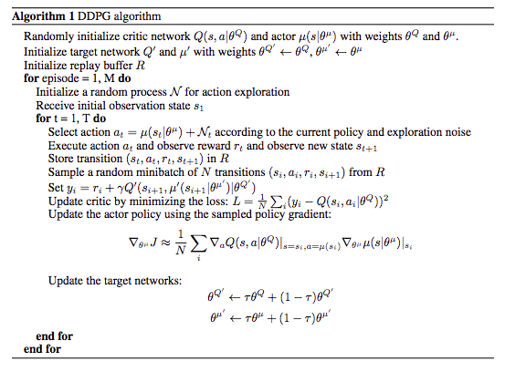
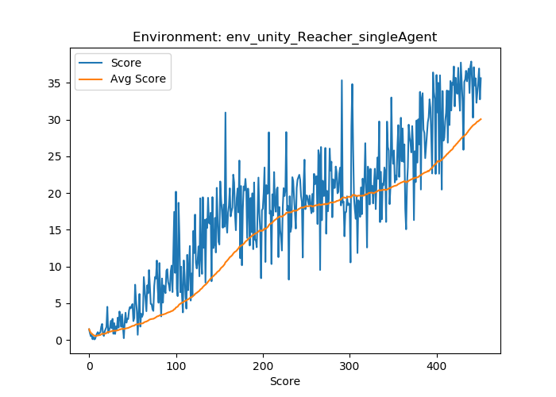
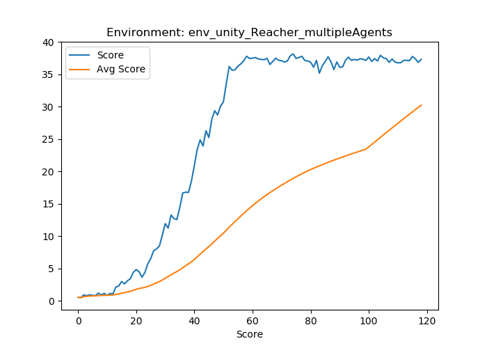
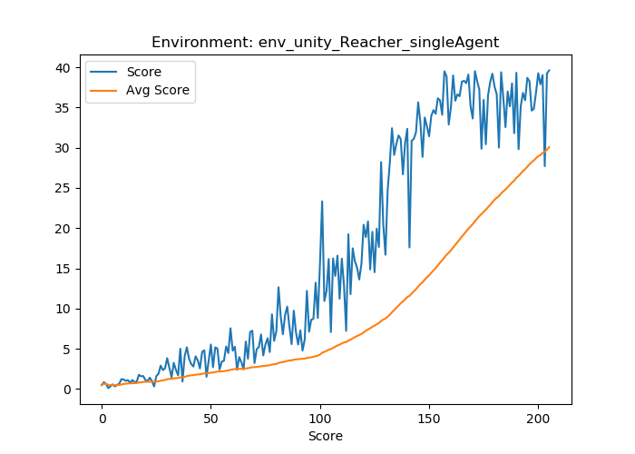
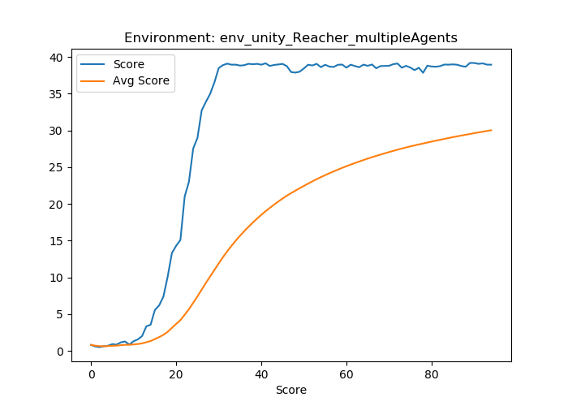

# Reacher Game Report

## Learning Algorithm
I've based my implementation on the deep deterministic gradient method (DDPG), [see paper](https://arxiv.org/abs/1509.02971v5). DDPG is an actor-critic method, which has been shown to perform well in environments with a continuous action space, which are not well handled by the DQN algorithm and its various extensions. The algorithm consists of two neural networks, the *actor* and the *critic*, where the *actor* is used to approximate the optimal deterministic policy, while the *critic* learns to evaluate the optimal action-value function based on actions from the *actor*. The idea is thus that the *actor* is used for specifying actions *a*, while the *critic* calculates a temporal difference error (TD error) that criticizes the actions made by the *actor*.

Following the same convergence arguments as found in the DQN algorithm, DDPG actually employs 4 neural networks; a local actor, a target actor, a local critic and a target critic. In addition, we also need to employ replay buffer in order to account for temporal sample correlation, and we use a so-called 'soft update' mechanism to update the weights of the target networks slowly - i.e. we continously slowly update the target networks based on the parameters in the local networks. In this solution, I've also implemented prioritized experience replay for DDPG, which works exactly the same as the implementation for DQN.

The learning algorithm is detailed by the following:


The implementation is such that the code can run for both the single-agent and 20-agent environment, and so that instead of only being able to use the traditional replay buffer, it can also use [Prioritized Experience Replay for DDPG(https://ieeexplore.ieee.org/document/8122622/).

## Hyperparameters
Settings used to solve the 1-agent and 20-agent environment. Values are inspired by [Zulkhuu repo](https://github.com/Zulkhuu/reinforcement-learning/blob/master/Reacher/docs/Report.md), especially in terms of number of hidden nodes in network layers, where the original paper values of [400, 300] were too much to give meaningful results.
```
BATCH_SIZE = 128        # Batch Size
BUFFER_SIZE = int(1e5)  # Memory capacity
GAMMA = 0.99            # Discount factor
LR_ACTOR = 1e-4         # Actor lerning rate
LR_CRITIC = 1e-4        # Critic learning rate
TAU = 1e-3              # Soft update of target networks
WEIGHT_DECAY = 0        # L2 weight decay for Critic
NOISE_SIGMA = 0.2       # sigma for Ornstein-Uhlenbeck noise

# Actor
dense_layers=[256, 128]

# Critic
dense_layers=[256, 128]
```

### Model Architecture
The **actor** network consists of three fully connected layers, where the first two have relu activations, and the final output layer yields 4 values with a tanh activation.

The **critic** also consists of three fully connected layers, where the first two have relu activations, and the action-vector is concatenated to the output of the first layer. The final layer has a single output.

As described in the [original paper](https://arxiv.org/abs/1509.02971v5), weights are initialized from uniform distributions based on the fan-in of the layer, except for the last layer which was initialized with from a uniform distribution from -3e-3 to 3e-3.

## Results / Plots of Rewards
The main investigation of this report was how priotized experience replay would influence the results. As seen from the following, the importance sampling does indeed help the agent learn faster.

### Normal replay buffer
<p float="left">
  
  
</p>

### Prioritized experience replay
<p float="left">
  
  
</p>

## Future Work
The main addition to off-the-shelf DDPG in this repository is prioritized experience replay. For future improvements of the DDPG agent, I'd look into:
- [ ] I'd look into further tuning hyperparameters
- [ ] I'd try reducing the Ornstein-Uhlenbeck noise as more episodes are played.
- [ ] Due to the instability of DDPG, I might look into its extensions such as [Self-Adaptive Double Bootstrapped DDPG (SOUP)](https://www.ijcai.org/proceedings/2018/0444.pdf) that advertise better training stability.